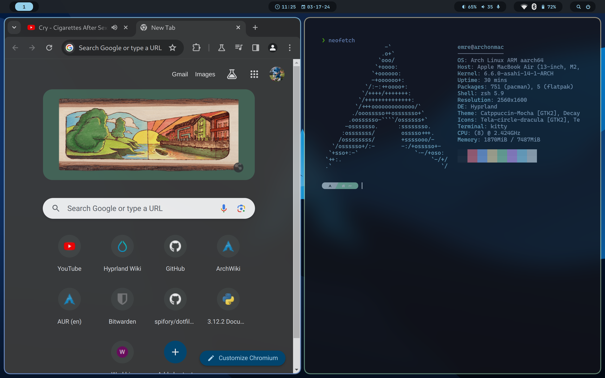
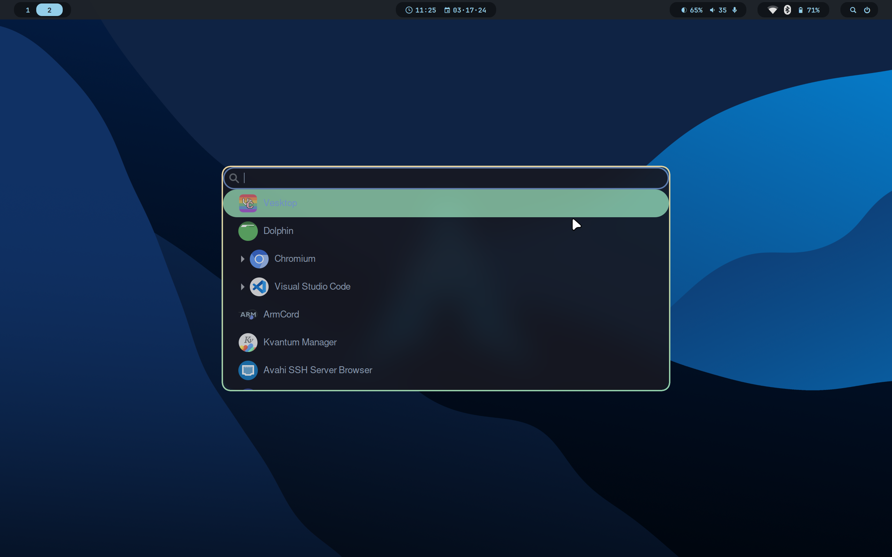
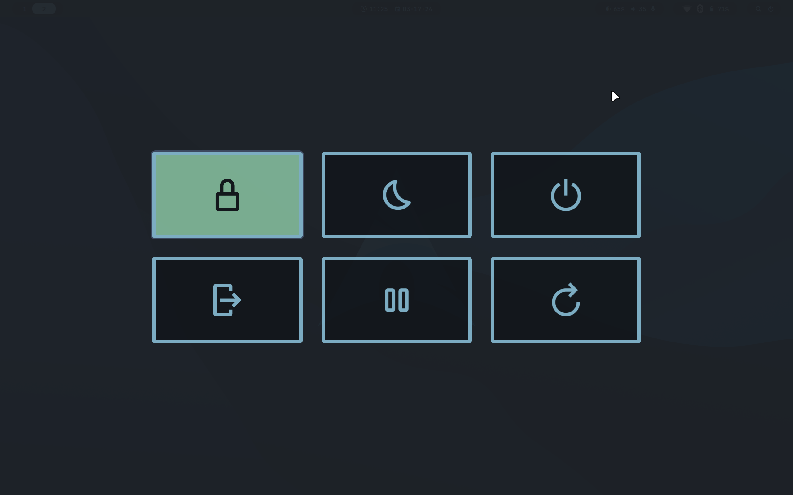

# My Dotfiles

Dotfiles for my Arch Linux on M2 Mac install!

## TODO

- Automate installation, much like hyprdots
- Clear the config of hyprdots bloat (there's a lot, especially scripts)
- Rewrite scripts to be in Python, Bash isn't ideal to work with
- Move away from the hyprdots themes? (I found an alternative to the Decay Green theme that is used)

## Packages Used

- Window Manager: [Hyprland](https://hyprland.org)

- Display Manager: [SDDM](https://github.com/sddm/sddm)

- App Launcher: [wofi](https://hg.sr.ht/~scoopta/wofi/)

- Menu Bar: [Waybar](https://github.com/Alexays/Waybar/)

- Browser: [Chromium](https://www.chromium.org/chromium-projects/)

- Terminal: [kitty](https://sw.kovidgoyal.net/kitty/)

- Notifications: [dunst](https://dunst-project.org/)

- Logout Menu: [wlogout](https://github.com/ArtsyMacaw/wlogout)

- Lock Screen: [swaylock](https://github.com/swaywm/swaylock)

There are a lot more packages needed for system-wise things, they are listed in [this file](./scripts/packages.txt).

## Installation

The installation is straightforward. 

Install all of the packages listed above and copy all of the config files from the repo to their appropriate locations.

Additionally, install any themes from the `themes` directory of this repo into their [appropriate locations](./scripts/themepaths.txt). This will be automated eventually via a script.

If you're using an Apple Silicon Mac, read [this guide](./apple_silicon_install.md) for installation steps.

## Credits

Thanks to Prasan for his [Hyprdots](https://github.com/prasanthrangan/hyprdots) project! A good amount of the config here is modified from that project, especially the Hyprland & Waybar theme.

Thanks to spifory for her [dotfiles](https://github.com/spifory/dotfiles)! The config files for wlogout & wofi are from her.
